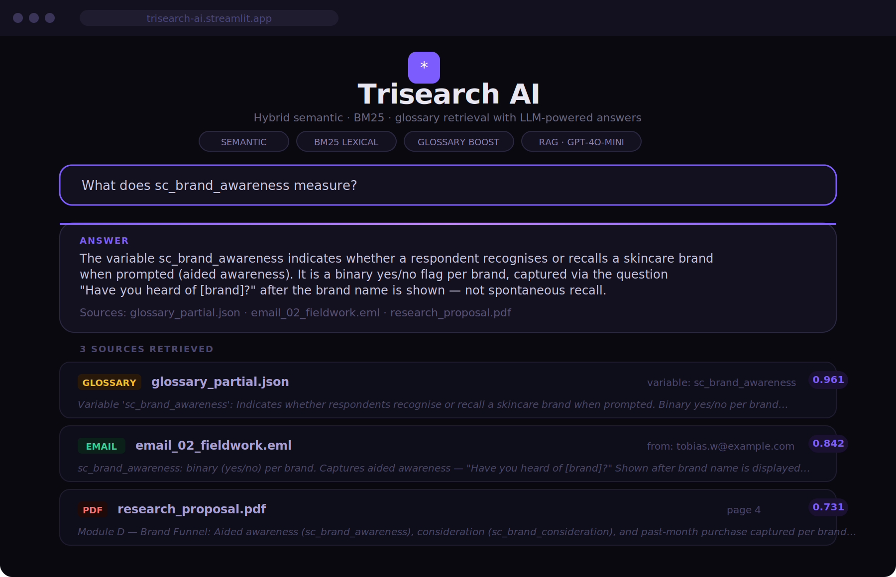

# 🔍 Trisearch AI

An AI-powered hybrid search engine that combines **semantic search + BM25 keyword matching + glossary boosting + LLM-based answer generation (RAG)** to retrieve and answer questions from multi-format documents.

---

## 🚀 Live Demo

👉 [trisearch-ai.streamlit.app](https://trisearch-ai.streamlit.app)

---

## 🖼️ UI Preview



---

## 🧠 Overview

Trisearch AI implements a three-signal **Retrieval-Augmented Generation (RAG)** pipeline:

1. 🔎 Classify the query — broad research question or narrow variable lookup
2. 🔁 Retrieve top-5 chunks using hybrid scoring (semantic + BM25 + glossary boost)
3. 🧠 Generate a grounded answer via streaming GPT-4o-mini
4. 📄 Display sources with file type, location metadata, and relevance score

---

## ✨ What Makes This Different

Unlike standard RAG systems that rely on a single retrieval signal, Trisearch AI:

- **Combines three signals** — semantic similarity, exact keyword matching (BM25), and domain-specific glossary boosting work together, not in isolation
- **Adapts retrieval strategy based on query type** — variable lookups are routed differently from open-ended research questions, improving precision for both
- **Provides transparent source-level explanations** — every answer is backed by ranked, labelled sources with file type, location, and relevance score visible to the user
- **Streams answers in real time** — responses appear token by token instead of after a long wait, making the experience feel fast and interactive

---

## 🎯 Motivation

Built to explore how hybrid retrieval systems improve search quality across heterogeneous enterprise document corpora — PDFs, slide decks, emails, Word docs, and JSON codebooks. The project demonstrates that combining semantic understanding, exact token matching, and domain-specific signal (glossary boost) produces more accurate and interpretable results than any single signal alone.

> This approach reduces hallucination and improves accuracy in real-world enterprise search scenarios.

---

## ⚙️ Features

**Retrieval Engine (`retrieve.py`)**
- Three-signal hybrid scoring: semantic embeddings + BM25 + glossary source boost
- Retrieval adapts dynamically — keyword-heavy queries rely more on BM25, while conceptual queries rely more on semantic similarity
- Query classifier (`_query_is_narrow`) — detects variable names, definitional keywords, and short lookup queries
- BM25 index built once at startup and cached — not rebuilt per query
- Glossary boost applied via pre-computed NumPy boolean mask (vectorised, O(1))
- MD5 hash-based deduplication — no false chunk collisions
- Rich metadata per chunk: page number (PDF), slide number (PPTX), sender and date (EML), variable name (JSON)

**Answer Generation (`rag.py`)**
- Streaming token generation via `stream=True` — first token appears in ~0.5s
- Correct OpenAI Chat Completions API (`client.chat.completions.create`)
- Graceful error handling — API failures return a readable message instead of crashing

**UI (`app.py`)**
- Dark-themed Streamlit interface with custom CSS (Syne + DM Sans fonts)
- `@st.cache_resource` index warm-up — model and BM25 load once at startup, cached for all reruns
- Clickable example queries pre-fill the search box (broad + narrow categories)
- Answer rendered inside a styled card — purple gradient top border
- Source cards with colour-coded file type badges (PDF, PPTX, DOCX, EMAIL, GLOSSARY), metadata, and relevance score
- `pending_query` session state pattern — compatible with Streamlit Cloud

**Synthetic Demo Dataset (`test_files/`)**
- Fully synthetic, safety-compliant dataset — fictional brand NovaSkinX, fictional agency DemoAnalytics
- All contacts use `@example.com`, all figures are distorted, all paths are generic (`/shared/data/demo/`)
- Disclaimer embedded in every file (JSON key, PDF banner, PPTX footer, DOCX header, EML header)
- 9 files across 5 formats: PDF research proposal, PPTX findings deck, DOCX questionnaire, 5 EML emails, JSON variable glossary

**Evaluation (`test_local.py`)**
- MRR (Mean Reciprocal Rank) and Precision@1 over a 14-query eval set
- Per-query breakdown with query type, reciprocal rank, P@1, and top retrieved source

---

## 🏗 Architecture

```
User Query
    │
    ▼
_query_is_narrow()          ← classify: broad or narrow
    │
    ▼
retrieve.py                 ← three-signal hybrid retrieval
    ├── Semantic score       (all-MiniLM-L6-v2 cosine similarity)
    ├── BM25 score           (cached BM25Okapi, tokenise-once)
    └── Glossary boost       (NumPy mask, applied on narrow queries)
    │
    ▼
Top-5 Chunks (deduplicated by MD5 hash)
    │
    ▼
rag.py                      ← streaming LLM answer generation
    └── GPT-4o-mini (stream=True, Chat Completions API)
    │
    ▼
app.py                      ← Streamlit UI
    ├── @st.cache_resource   (index warm-up, runs once)
    ├── Answer card          (full HTML injected in single st.markdown call)
    └── Source cards         (badge + filename + meta + score)
```

---

## 🛠 Tech Stack

| Layer | Library / Tool |
|---|---|
| UI | Streamlit |
| Embeddings | Sentence Transformers `all-MiniLM-L6-v2` |
| Lexical retrieval | `rank-bm25` (BM25Okapi) |
| LLM | OpenAI API `gpt-4o-mini` |
| PDF parsing | `pypdf` |
| DOCX parsing | `python-docx` |
| PPTX parsing | `python-pptx` |
| Numerics | NumPy, Scikit-learn |

---

## 📁 Project Structure

```
.
├── app.py                  ← Streamlit UI with cached index warm-up
├── rag.py                  ← Streaming LLM answer generation
├── retrieve.py             ← Three-signal hybrid retrieval engine
├── test_local.py           ← Local evaluation runner (MRR + P@1)
├── test_files/             ← Synthetic demo dataset (9 files, 5 formats)
│   ├── glossary_partial.json
│   ├── research_proposal.pdf
│   ├── phase2_findings.pptx
│   ├── NovaSkinX_questionnaire.docx
│   ├── email_01_kickoff.eml
│   ├── email_02_fieldwork.eml
│   ├── email_03_analysis.eml
│   ├── email_04_phase2.eml
│   └── email_05_followup.eml
├── requirements.txt
└── README.md
```

---

## ⚡ Installation

```bash
pip install -r requirements.txt
```

---

## 🔑 Environment Setup

```bash
export OPENAI_API_KEY="your_api_key_here"
```

On Streamlit Cloud, add `OPENAI_API_KEY` under **App settings → Secrets**.

---

## ▶️ Run Locally

```bash
streamlit run app.py
```

The app warms up the embedding model and BM25 index on first load (~10–15s). All subsequent queries are fast.

---

## 🧪 Local Evaluation

```bash
python test_local.py
```

Runs retrieval over a 14-query eval set and prints MRR, P@1, and a per-query breakdown table.

---

## 💡 Example Queries

**Broad — research questions**
```
What was the main finding of the NovaSkinX study?
Who are the probable trialists and what do they look like?
How much do regular skincare buyers spend per month?
What are the main barriers to purchasing NovaSkinX?
```

**Narrow — variable lookups**
```
What does sc_brand_awareness measure?
What does sc_brand_consideration capture?
What is n_skincare_steps_per_day?
What are probable_trialists?
```

---

## 📌 Key Technical Highlights

- **Three-signal hybrid retrieval** — semantic + lexical + domain boost, not just one signal
- **Adaptive query classification** — automatically routes broad vs. narrow queries to different blend weights
- **BM25 cached at startup** — index built once, reused across all queries (not rebuilt per call)
- **Streaming LLM responses** — `stream=True` via Chat Completions API, first token in ~0.5s
- **`@st.cache_resource` index warm-up** — embedding model and parsed documents loaded once per server process
- **Safe synthetic dataset** — fully fictional brand, distorted figures, disclaimer in every file, no real data
- **End-to-end evaluation harness** — MRR + P@1 with per-query detail, not just manual testing

---

## ⚠️ Dataset Notice

The `test_files/` directory contains a **fully synthetic demo dataset**. No real company, brand, individual, or research study is represented. All figures are fabricated. The dataset was designed to match the structural complexity of real enterprise research corpora (multi-format, mixed variable types, email threads, codebooks) without using any proprietary data.

---

## 👨‍💻 Author

Yuvanesh Raju  
[linkedin.com/in/yuvaneshraju](https://linkedin.com/in/yuvaneshraju)
